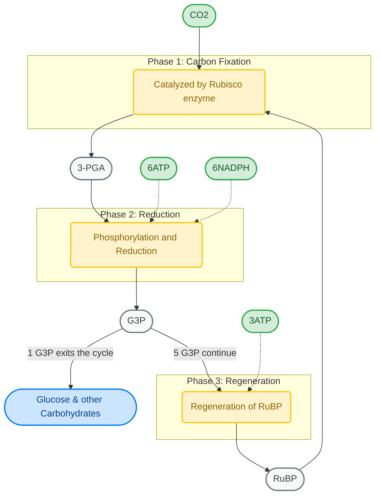

18 carbon atoms (6 molecules of 3-phosphoglycerate) are produced which undergo a cycle of reactions that regenerates the 3 molecules of ribulose 1,5-bisphosphate used in the initial carbon fixing step. Net gain is one molecule of glyceraldehyde 3-phosphate. 3 molecules of $ATP$ and 2 molecules of $NADPH$ are consumed for each $CO_{2}$ converted into carbohydrate.
$$
3CO_{2}+9ATP+6NADPH\xrightarrow{\text{water}} \text{glyceraldehyde 3-phosphate}+8P_{i}+9ADP+6NADP^{+}
$$

Links: [[Chloroplast]]
Date created: Mon/30/Mar/2026

