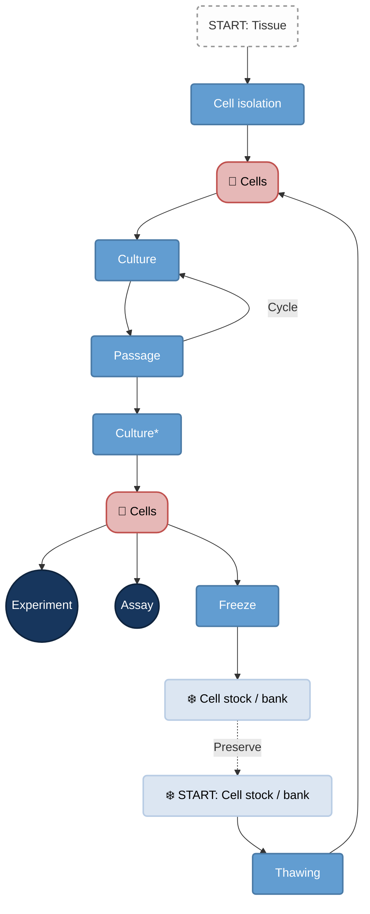

The process of growing cells outside their natural environment, usually in a petri dish. 2D cell culture grows as a monolayer on surfaces like polystyrene or glass.
#### Primary Cell Cultures
Initial cell cultures established from a tissue are primary cell cultures. They closely resemble the original tissue. They have a limited lifespan, finite cells and more variability. Ex: Human fibroblasts, neurons and keratinocytes.
#### Immortal Cell Cultures
These are cells that have been genetically altered to divide indefinitely. They are easy to maintain, proliferate indefinitely and give reproducible results. Such permanent cell cultures provide a continuous, uniform source of cells that can be manipulated, cloned and propogated indefinitely. The first human cell line to be made was **HeLa**, isolated from a cervical cancer in 1951 and has been used in thousands of labs. Ex: HeLa, 239T
##### Cancer Cell Lines
Derived from tumors, are effectively immortal. Used in understanding oncogenic signaling, metastasis and drug resistance. Ex: A549 (Lung cancer), HCT116 (Colorectal cancer), PC-3 (Prostate cancer), HeLa (Cervical cancer), MCF-7 (Breast cancer).
##### Immune Cell Lines
Immune cells are cultured. Their uses include evaluating T cell responses and antibody cytotoxicity, drug development by screening new compounds for efficacy and toxicity and studyong signaling pathways and cytokine production. Ex: Jurkat (Human T cells), Raji (Human B cells), K-562-GFP (NK cells), THP-1 (Human Monocytes), RAW264.7 (Mouse macrophages)
##### Stem Cell Lines
Embryonic stem cells (ESCs) are pluripotent, can differentiate into any type. Induced pluripotent stem cells (iPSCs) are reprogammed somatic cells for patient specific modeling. It is used in developmental biology, regenerative medicine and differentiation studies.
##### Reporter Cell Lines
Engineered to express fluorescent or luminescent markers. Used for live cell imaging, real time monitoring of signaling pathways and gene expression dynamics.
### 3D Cell Culture
Spheroid and organoid cultures provide more relevant models by better mimicking in vivo tissue than 2D cultures. Organoids are self organizing, stem cell divided derived 3D cell cultures that mimic organ functionality, enabling advanced disease modeling, drug discovery and personalized medicine.

Links: 
Date created: Sat/18/Apr/2026