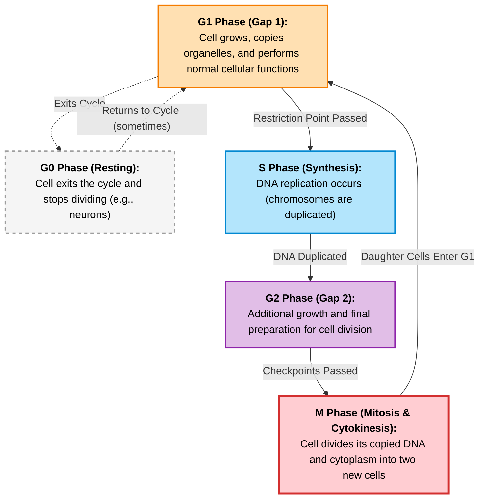
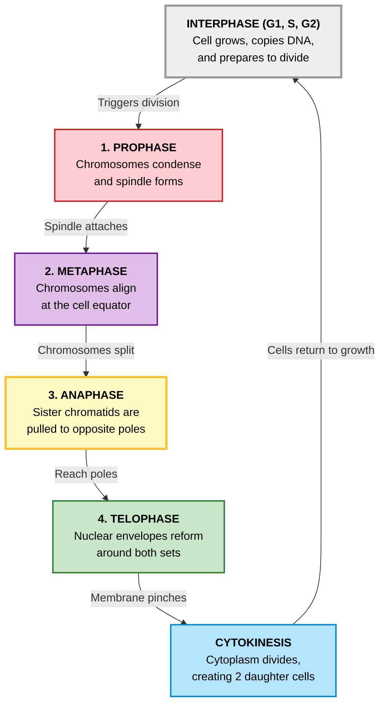

The eukaryotic cell cycle is divided into four stages: G1, S, G2 and M. G0 is the rest phase. Cyclin-CDK complexes are what drives the cycle and checkpoint pathways guarentee the completion of each cycle before the next one is initiated.

Prophase, nuclear envelope breaks down and microtubules form mitotic spindles. Metaphase, attachment of chromosomes to microtubules via kinetochores.
Anaphase, microtubules pull sister chromatids toward opposite spindle pores. After chromosome movement to spindle poles, chromosomes decondense and cells reassemble nuclear membrane around daughter cell.

Links: [[Eukaryotes]]  
Date created: Wed/01/Apr/2026
