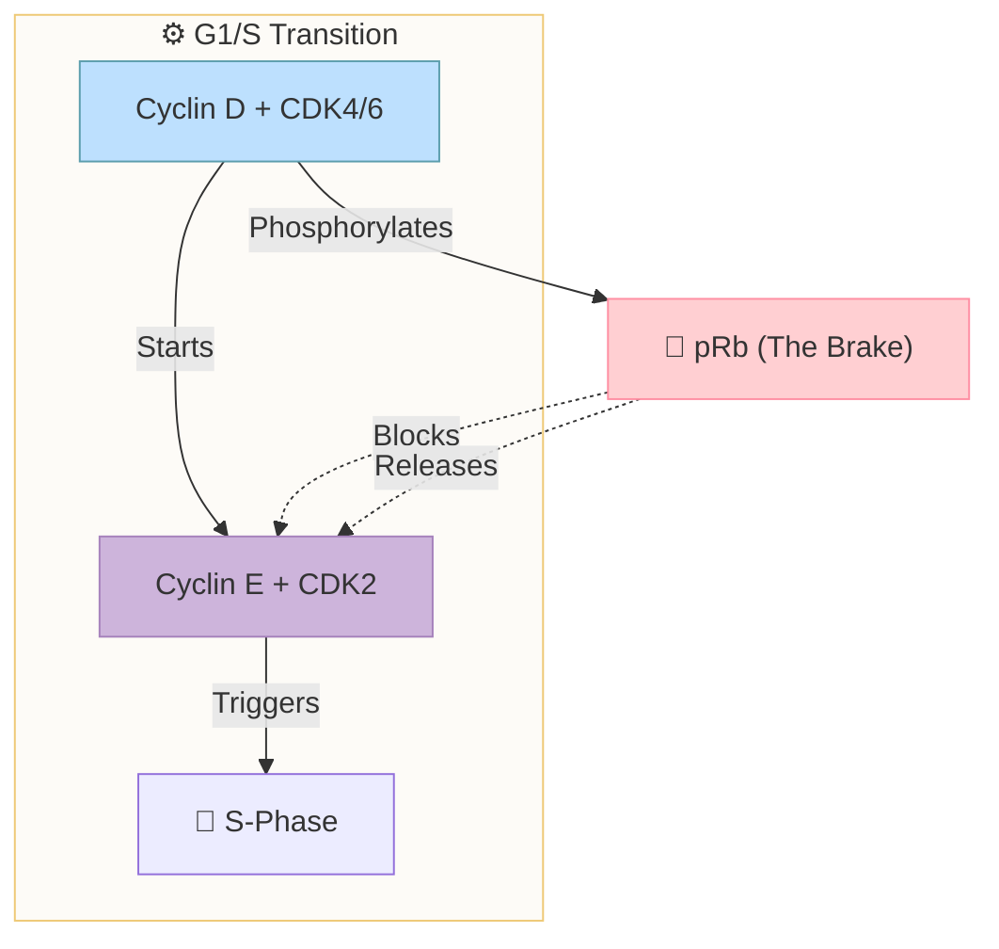

The cell cycle control system is based on two key families of proteins: CDKs (cyclin-dependent kinases), which induce downstream processes by phosphorylating selected proteins on serines and threonines; and cyclins, which bind to CDK molecules and control their ability to phosphorylate. Cyclins undergo a cycle of synthesis and degradation each cell cycle, but the level of CDK is constant.
There are four types of cyclins: G1/S, S, M and G1. In yeast, only one CDK binds all cyclins, and in vertebrates there are four. The full activation of Cyclin-CDK occurs when a separate enzyme (CAK) phosphorylates an amino acid near the active site which causes a small conformational change, allowing kinase to phosphorylate its target proteins to induce the cycle. Wee1 kinase phosphorylates two closely spaced sites above the active sites, removal of phosphates by cdc25 activates cyclin-CDK.

Links: [[Cell Cycle]]
Date created: Wed/01/Apr/2026