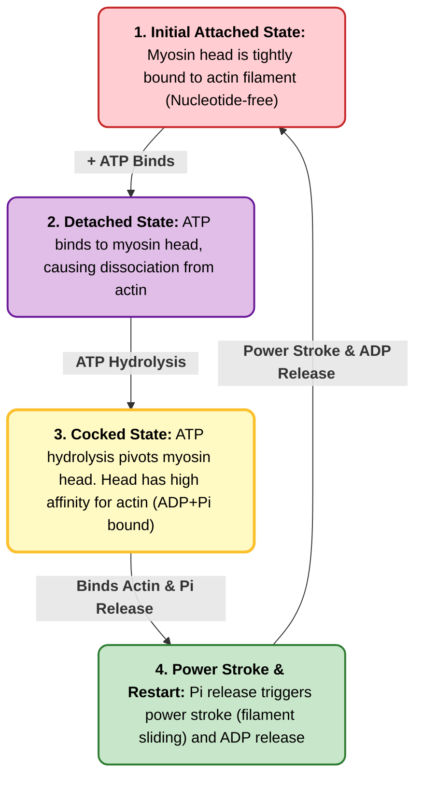

Muscle fibres contain single, elongated, multinucleated cells that arise from fusion of precursor cells. The fibres are made up of many myofibrils surrounded by sarcoplasmic reticulum. Organization of thick and thin filaments in a myofibril gives it a striated appearance. When muscle contracts, I band narrows and Z disks move closer.

![[Pasted image 20260401171953.png|500]]

Muscle contraction occurs by sliding of thick and thin filaments past each other so that Z disks in neighboring I bands grow closer. The thick and thin filaments are interleaved such that each thick filament is surrounded by 6 thin ones. It is also regulated by tropomyosin and troponin, which is attached to actin-tropomyosin complex. The subunits of troponin - I, C and T - prevent binding of myosin head to actin, has a binding site for $Ca^{+2}$ and link entire troponin complex to tropomyosin respectively. When muscle receives a signal to contract, $Ca^{+2}$ is released from sarcoplasmic reticulum and binds to troponin C, which alter position of troponin I so as to relieve inhibition and allow contraction.

Links: [[Cytoskeleton]]
Date created: Wed/01/Apr/2026

