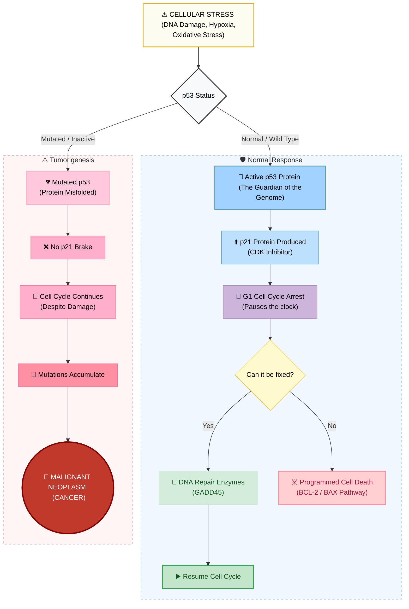

p53 works by arresting the cell cycle when there is damage, and shuts it off until repair is done. If it cannot be repaired, apoptosis occurs. A mutated p53 fails to do this and damaged cell continues to divide, which may result in cancer.

Links: [[Cancer]] 
Date created: Wed/01/Apr/2026