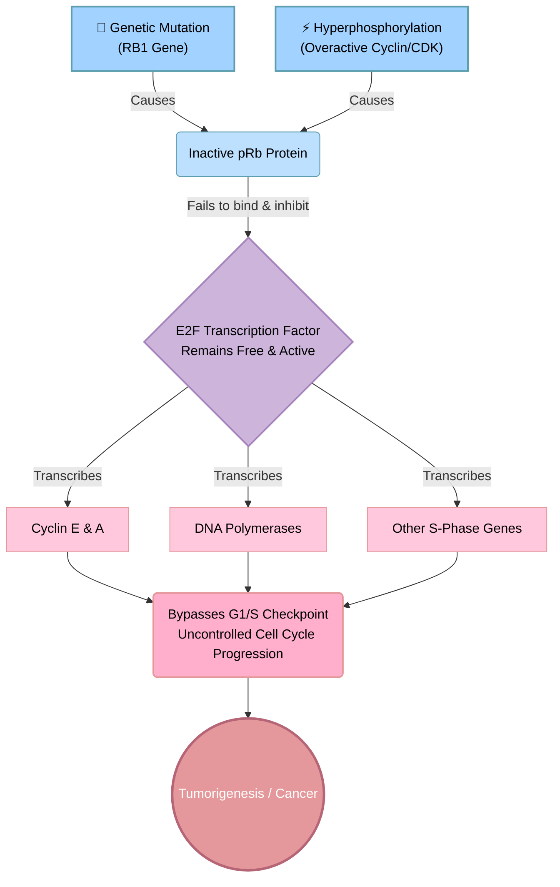

Rb protein negatively regulates the cell cycle and is responsible for a major G1 checkpoint, blocking S phase and cell growth. The retinoblastoma protein (pRb) is dysfunctional in several major cancers due to its phosphorylation.

Links: [[Cancer]]
Date created: Wed/01/Apr/2026

